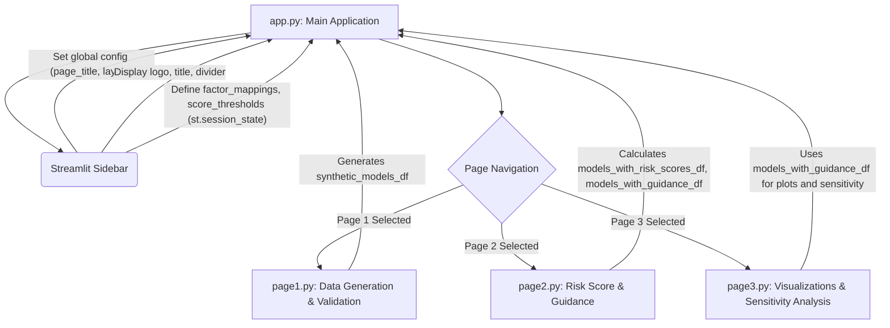

id: 688a3a6b87e52be5b89d93d7_documentation
summary: Lab 1 for Module 1: Introduction Documentation
feedback link: https://docs.google.com/forms/d/e/1FAIpQLSfWkOK-in_bMMoHSZfcIvAeO58PAH9wrDqcxnJABHaxiDqhSA/viewform?usp=sf_link
environments: Web
status: Published
# Model Risk Materiality and Impact Simulator with Streamlit

## 1. Introduction to Model Risk Materiality and Application Overview
Duration: 0:08:00

<aside class="positive">
This initial step provides crucial context for the entire codelab. Understanding the core problem of model risk and the concept of materiality is essential before diving into the application's functionalities. Pay close attention to the **Learning Goals** as they outline what you will achieve by the end of this lab.
</aside>

In the dynamic world of financial institutions, models are indispensable tools for everything from credit underwriting to sophisticated risk management. However, these models are not without their inherent dangers, collectively known as **Model Risk**. Model risk is formally defined as "the potential for adverse consequences from erroneous or misused model outputs" [1, Page 6]. Effectively managing this risk is paramount for maintaining financial stability and regulatory compliance.

This Streamlit application, "QuLab," serves as an interactive simulator to demystify model risk materiality. It allows users to simulate various model scenarios to understand how different characteristics—such as complexity, data quality, usage frequency, and business impact—contribute to overall model risk and influence the required rigor of model risk management. A central theme explored is **materiality**, which posits that the level of impact a model has on a bank's financial condition dictates the complexity and rigor of its risk management approach [1, Page 8].

**Learning Goals:**
- Understand how model characteristics contribute to overall model risk.
- Learn to assess the materiality of a model based on its potential business impact.
- Explore how different levels of model risk necessitate varying degrees of risk management rigor.
- Understand the key insights contained in the provided document and supporting data through practical application.

The application is structured as a multi-page Streamlit application, facilitating a guided exploration of model risk concepts:
- **Page 1: Data Generation & Validation**: Focuses on creating synthetic model data and performing initial data integrity checks.
- **Page 2: Risk Score Calculation & Guidance**: Defines and computes model risk scores, then assigns appropriate management guidance based on materiality thresholds.
- **Page 3: Visualizations & Sensitivity Analysis**: Offers various plots to visualize model risk distributions and performs sensitivity analysis on key parameters to understand their impact.

## 2. Application Architecture and Global Configuration
Duration: 0:05:00

The "QuLab" application leverages Streamlit's multi-page architecture to provide a structured and interactive learning experience. The `app.py` file acts as the main entry point and orchestrator, handling global configurations and navigating between different functional pages.

### Application Flow Diagram

The following diagram illustrates the high-level architecture and flow of the application:



### Global Configurations in `app.py`

The `app.py` script performs initial setup and defines key parameters that are shared across all pages using Streamlit's `st.session_state`. This ensures consistency and seamless data transfer as users navigate the application.

```python
# app.py
import streamlit as st
import pandas as pd
import numpy as np
import plotly.express as px
import plotly.graph_objects as go
import io

# Set a random seed for reproducibility
np.random.seed(42)

# Configure the Streamlit page
st.set_page_config(page_title="QuLab", layout="wide")
st.sidebar.image("https://www.quantuniversity.com/assets/img/logo5.jpg")
st.sidebar.divider()
st.title("QuLab")
st.divider()

# Initial markdown for the main page
st.markdown("""
# ... (Introduction and Learning Goals) ...
""")

# Define factor mappings and score thresholds globally in session state
if "factor_mappings" not in st.session_state:
    st.session_state.factor_mappings = {
        'complexity_level': {'Low': 1, 'Medium': 3, 'High': 5},
        'data_quality_index': lambda x: (100 - x) / 10, # Higher quality = lower risk score
        'usage_frequency': {'Low': 1, 'Medium': 3, 'High': 5},
        'business_impact_category': {'Low': 1, 'Medium': 3, 'High': 5, 'Critical': 10}
    }
if "score_thresholds" not in st.session_state:
    st.session_state.score_thresholds = {
        'Standard Oversight': 3,
        'Enhanced Scrutiny': 6,
        'Rigorous Management': np.inf
    }

# Page navigation via sidebar
page = st.sidebar.selectbox(label="Navigation", options=["Page 1: Data Generation & Validation", "Page 2: Risk Score & Guidance", "Page 3: Visualizations & Sensitivity Analysis"])

# Dynamic page loading based on selection
if page == "Page 1: Data Generation & Validation":
    from application_pages.page1 import run_page1
    run_page1()
elif page == "Page 2: Risk Score & Guidance":
    from application_pages.page2 import run_page2
    run_page2()
elif page == "Page 3: Visualizations & Sensitivity Analysis":
    from application_pages.page3 import run_page3
    run_page3()
```

<aside class="positive">
Notice how `factor_mappings` and `score_thresholds` are stored in `st.session_state`. This is a best practice in Streamlit for persisting data and configurations across different pages and reruns of the application, ensuring a consistent user experience.
</aside>

## 3. Understanding Model Risk Factors (Page 1)
Duration: 0:04:00

Before generating any data, it's crucial to understand the fundamental attributes that contribute to model risk. As stated in the provided document, "Risk increases with complexity, uncertainty about inputs and assumptions, broader use, and larger potential impact" [1, Page 7]. This application quantifies these factors using four key attributes for our synthetic models:

1.  **Complexity Level**: The inherent intricacy of the model. More complex models often involve more assumptions and intricate logic, increasing potential for errors. (Categorical: 'Low', 'Medium', 'High')
2.  **Data Quality Index**: A measure of the reliability, accuracy, and completeness of the input data. Poor data quality can lead to erroneous model outputs. (Numeric: 0-100, where higher is better quality)
3.  **Usage Frequency**: How often the model is run or its outputs are used. Models with broader or more frequent use can have a wider impact if flawed. (Categorical: 'Low', 'Medium', 'High')
4.  **Business Impact Category**: The potential financial or reputational consequences if the model's outputs are incorrect or misused. This is central to the concept of **materiality**. (Categorical: 'Low', 'Medium', 'High', 'Critical')

These factors, along with their numerical mappings defined in `st.session_state.factor_mappings` (from `app.py`), will be used to calculate a composite Model Risk Score.

## 4. Data Generation and Validation (Page 1)
Duration: 0:07:00

The first page of the application, managed by `application_pages/page1.py`, focuses on generating a synthetic dataset of models and validating its structure. This dataset serves as the foundation for all subsequent risk analyses.

### Generating Synthetic Model Data

The `generate_synthetic_model_data` function creates a Pandas DataFrame where each row represents a synthetic model with randomly assigned attributes for complexity, data quality, usage frequency, and business impact.

```python
# application_pages/page1.py (excerpt)
import streamlit as st
import pandas as pd
import numpy as np
import io # Used for dataframe info capture

@st.cache_data  # Cache the dataframe generation for performance
def generate_synthetic_model_data(num_models):
    """
    Generates a Pandas DataFrame of synthetic model attributes for risk analysis.
    """
    if not isinstance(num_models, int):
        raise TypeError("num_models must be an integer.")
    if num_models < 0:
        raise ValueError("num_models must be a non-negative integer.")

    expected_columns = [
        'model_id', 'complexity_level', 'data_quality_index',
        'usage_frequency', 'business_impact_category'
    ]

    if num_models == 0:
        return pd.DataFrame(columns=expected_columns)

    complexity_levels = ['Low', 'Medium', 'High']
    usage_frequencies = ['Low', 'Medium', 'High']
    business_impact_categories = ['Low', 'Medium', 'High', 'Critical']

    data = {
        'model_id': [f'model_{i:03d}' for i in np.arange(num_models)],
        'complexity_level': np.random.choice(complexity_levels, size=num_models),
        'data_quality_index': np.random.randint(50, 101, size=num_models),
        'usage_frequency': np.random.choice(usage_frequencies, size=num_models),
        'business_impact_category': np.random.choice(business_impact_categories, size=num_models)
    }

    df = pd.DataFrame(data, columns=expected_columns)
    # Ensure categorical types with defined order
    df['complexity_level'] = pd.Categorical(df['complexity_level'], categories=complexity_levels, ordered=True)
    df['usage_frequency'] = pd.Categorical(df['usage_frequency'], categories=usage_frequencies, ordered=True)
    df['business_impact_category'] = pd.Categorical(df['business_impact_category'], categories=business_impact_categories, ordered=True)

    return df

# ... (Streamlit UI for input and button in run_page1) ...

# Data generation in run_page1 function:
# with st.sidebar:
#     num_models_input = st.number_input("Number of Synthetic Models", min_value=0, max_value=1000, value=100, key="num_models_input")
#     if st.button("Generate Synthetic Data", key="generate_data_button"):
#         st.session_state.synthetic_models_df = generate_synthetic_model_data(num_models_input)
#         st.success(f"Generated {num_models_input} synthetic models.")

# Displaying data
# if 'synthetic_models_df' not in st.session_state or st.session_state.synthetic_models_df.empty:
#     st.info("Please generate synthetic model data using the sidebar controls.")
# else:
#     st.subheader("Head of the Synthetic Model Dataset:")
#     st.dataframe(st.session_state.synthetic_models_df.head())
#     st.subheader("DataFrame Info:")
#     buffer = io.StringIO()
#     st.session_state.synthetic_models_df.info(buf=buffer)
#     st.text(buffer.getvalue())
```

<aside class="positive">
The `@st.cache_data` decorator is a powerful Streamlit feature that optimizes performance by caching the output of functions. If the inputs to `generate_synthetic_model_data` (i.e., `num_models`) don't change, the function won't rerun, saving computation time.
</aside>

### Data Validation and Exploration

The `validate_and_summarize_data` function performs essential integrity checks and provides summary statistics for the generated DataFrame. This step ensures that the data is in the expected format before proceeding with risk calculations.

```python
# application_pages/page1.py (excerpt)

def validate_and_summarize_data(df):
    """
    Performs validation checks and prints summary statistics for the input DataFrame.
    Checks for:
    - DataFrame type
    - Presence of expected columns
    - Absence of unexpected columns
    - Correct data types for critical columns
    - Uniqueness of 'model_id'
    - Absence of missing values in critical columns
    Prints summary statistics (describe, value_counts).
    """
    if not isinstance(df, pd.DataFrame):
        st.error(f"Error: Expected a Pandas DataFrame as input, but got {type(df).__name__}.")
        return

    expected_columns_list = [
        'model_id', 'complexity_level', 'data_quality_index',
        'usage_frequency', 'business_impact_category'
    ]
    expected_dtype_names = {
        'model_id': ['object'],
        'complexity_level': ['category'],
        'data_quality_index': ['int64'],
        'usage_frequency': ['category'],
        'business_impact_category': ['category']
    }
    critical_columns_for_na_check = expected_columns_list

    st.subheader(" DataFrame Validation ")

    # Column checks
    df_columns = set(df.columns)
    expected_columns_set = set(expected_columns_list)
    missing_expected_columns = expected_columns_set - df_columns
    unexpected_columns = df_columns - expected_columns_set
    if missing_expected_columns: st.warning(f"Missing expected columns: {sorted(list(missing_expected_columns))}")
    else: st.success("All expected columns are present.")
    if unexpected_columns: st.warning(f"Unexpected columns found: {sorted(list(unexpected_columns))}")
    
    # Data type checks
    current_all_dtypes_match = True
    for col, expected_names in expected_dtype_names.items():
        if col in df.columns:
            actual_dtype_name = str(df[col].dtype)
            if not any(expected_name == actual_dtype_name for expected_name in expected_names):
                st.warning(f"Mismatch in data type for column: {col} (expected {', '.join(expected_names)}, got {actual_dtype_name})")
                current_all_dtypes_match = False
    if current_all_dtypes_match: st.success("All column data types are as expected.")

    # Uniqueness check for model_id
    if 'model_id' in df.columns:
        if df.empty: st.info("model_id is unique. (DataFrame is empty)")
        elif df['model_id'].duplicated().any(): st.warning("Duplicate model_id values found.")
        else: st.success("model_id is unique.")

    # Missing values check
    found_missing_in_critical = []
    for col in critical_columns_for_na_check:
        if col in df.columns:
            if df[col].isnull().any():
                found_missing_in_critical.append(col)
    if found_missing_in_critical: st.warning(f"Missing values found in critical columns: {sorted(found_missing_in_critical)}")
    else: st.success("No missing values found in critical columns.")

    st.subheader("\n Summary Statistics for DataFrame ")
    if df.empty: st.info("DataFrame is empty.")
    
    numerical_df = df.select_dtypes(include=np.number)
    if not numerical_df.empty:
        st.markdown("\nDescription for numerical columns:")
        st.dataframe(numerical_df.describe())
    
    categorical_df = df.select_dtypes(include='category')
    if not categorical_df.empty:
        st.markdown("\nValue counts for categorical columns:")
        for col in categorical_df.columns:
            st.markdown(f"\n {col} ")
            st.dataframe(df[col].value_counts(dropna=False))

# ... (Streamlit UI to call validate_and_summarize_data in run_page1) ...
# if 'synthetic_models_df' in st.session_state and not st.session_state.synthetic_models_df.empty:
#     validate_and_summarize_data(st.session_state.synthetic_models_df)
# else:
#     st.info("No data available for validation. Please generate synthetic models.")
```

## 5. Defining the Model Risk Score Calculation (Page 2)
Duration: 0:08:00

On "Page 2: Risk Score & Guidance," handled by `application_pages/page2.py`, we implement the core logic for quantifying model risk. This involves defining a weighted sum methodology where each model characteristic is assigned a numerical score and combined using user-defined weights.

The formula for the Model Risk Score is:
$$ \text{Model Risk Score} = w_C S_C + w_{DQ} S_{DQ} + w_{UF} S_{UF} + w_{BI} S_{BI} $$
Where:
- $S_C$: Score for Complexity Level
- $S_{DQ}$: Score for Data Quality Index (inverted, higher quality = lower risk score)
- $S_{UF}$: Score for Usage Frequency
- $S_{BI}$: Score for Business Impact Category
- $w_C, w_{DQ}, w_{UF}, w_{BI}$: Respective weights for each factor, summing to 1.0.

The `factor_mappings` (defined in `app.py`) convert categorical or numerical inputs into standardized risk scores:

-   `complexity_level`: {'Low': 1, 'Medium': 3, 'High': 5}
-   `data_quality_index`: `(100 - value) / 10` (transforms 0-100% quality to 0-10 risk score, where 100% quality maps to 0 risk, and 0% quality maps to 10 risk).
-   `usage_frequency`: {'Low': 1, 'Medium': 3, 'High': 5}
-   `business_impact_category`: {'Low': 1, 'Medium': 3, 'High': 5, 'Critical': 10}

Users can adjust the weights for each factor using sliders in the sidebar. These weights are crucial as they allow for customization of the risk assessment model based on institutional priorities.

```python
# application_pages/page2.py (excerpt)
import streamlit as st
import pandas as pd
import numpy as np

def calculate_model_risk_score(df, weights, factor_mappings):
    """Computes a model risk score for each model in the DataFrame."""
    if not np.isclose(sum(weights.values()), 1.0):
        raise ValueError(f"Weights must sum to 1.0. Current sum: {sum(weights.values())}")

    df_output = df.copy()
    df_output['model_risk_score'] = 0.0

    for factor, weight in weights.items():
        if factor not in df_output.columns:
            raise KeyError(f"Missing required column: \'{factor}\' in the input DataFrame.")

        mapping = factor_mappings.get(factor)
        if mapping is None:
            raise ValueError(f"No mapping defined in \'factor_mappings\' for factor: \'{factor}\'.")

        factor_scores = None
        if isinstance(mapping, dict):
            try:
                factor_scores = df_output[factor].apply(lambda x: mapping[x])
            except KeyError as e:
                raise KeyError(f"Unknown categorical value \'{e.args[0]}\' encountered for factor \'{factor}\'. "
                               f"Expected one of: {list(mapping.keys())}.") from e
        elif callable(mapping):
            factor_scores = df_output[factor].apply(mapping)
        else:
            raise TypeError(f"Unsupported mapping type for factor \'{factor}\'. "
                            "Mapping must be a dictionary for categorical values or a callable for continuous values.")

        df_output['model_risk_score'] += factor_scores * weight

    return df_output

# ... (Streamlit UI for weights and calculation in run_page2) ...
# if 'synthetic_models_df' not in st.session_state or st.session_state.synthetic_models_df.empty:
#     st.warning("Please go to 'Page 1: Data Generation & Validation' to generate synthetic model data first.")
#     return

# st.sidebar.subheader("Model Risk Score Configuration")
# st.sidebar.markdown(r"**Factor Weights (Sum must be 1.0):**")
# wc = st.sidebar.slider("Complexity Level Weight ($w_C$)", 0.0, 1.0, st.session_state.get('wc_weight', 0.2), 0.05, key="wc_slider")
# wdq = st.sidebar.slider("Data Quality Index Weight ($w_{DQ}$)", 0.0, 1.0, st.session_state.get('wdq_weight', 0.2), 0.05, key="wdq_slider")
# wuf = st.sidebar.slider("Usage Frequency Weight ($w_{UF}$)", 0.0, 1.0, st.session_state.get('wuf_weight', 0.1), 0.05, key="wuf_slider")
# wbi = st.sidebar.slider("Business Impact Category Weight ($w_{BI}$)", 0.0, 1.0, st.session_state.get('wbi_weight', 0.5), 0.05, key="wbi_slider")

# current_weights_sum = wc + wdq + wuf + wbi
# st.sidebar.markdown(f"**Current Weights Sum:** {current_weights_sum:.2f}")

# if not np.isclose(current_weights_sum, 1.0):
#     st.sidebar.error("Weights must sum to 1.0!")
# else:
#     # Update session state weights and trigger calculation
#     st.session_state.wc_weight = wc
#     st.session_state.wdq_weight = wdq
#     st.session_state.wuf_weight = wuf
#     st.session_state.wbi_weight = wbi
#     if st.sidebar.button("Calculate Risk Scores", key="calculate_risk_button"):
#         current_weights = {
#             'complexity_level': st.session_state.wc_weight,
#             'data_quality_index': st.session_state.wdq_weight,
#             'usage_frequency': st.session_state.wuf_weight,
#             'business_impact_category': st.session_state.wbi_weight
#         }
#         st.session_state.models_with_risk_scores_df = calculate_model_risk_score(st.session_state.synthetic_models_df, current_weights, st.session_state.factor_mappings)
#         st.success("Model risk scores calculated!")
```

<aside class="negative">
It's critical that the sum of all weights equals 1.0. The application includes a validation check to ensure this constraint is met. Failure to meet this condition will prevent the calculation of risk scores, as the weighted sum would not accurately reflect the relative contribution of each factor.
</aside>

## 6. Assessing Materiality and Management Guidance (Page 2)
Duration: 0:05:00

After calculating the `model_risk_score`, the application proceeds to assess the **materiality** of each model and assign appropriate **management guidance**. This step directly translates the quantitative risk score into actionable oversight strategies. The guidance levels are based on predefined `score_thresholds` (also defined globally in `app.py`).

**Risk Score Thresholds and Guidance:**
- `model_risk_score` $ \le 3$: 'Standard Oversight' (Less complex management approach)
- $3 < \text{model\_risk\_score} \le 6$: 'Enhanced Scrutiny' (Requires more attention and review)
- `model_risk_score` $ > 6$: 'Rigorous Management' (More rigorous and extensive framework)

```python
# application_pages/page2.py (excerpt)

def provide_materiality_guidance(df, score_thresholds):
    """
    Assigns a risk management guidance level to each model based on its calculated model risk score and predefined thresholds.
    """
    df_copy = df.copy()

    if df_copy.empty or 'model_risk_score' not in df_copy.columns:
        df_copy['management_guidance'] = pd.Series([], dtype=str)
        return df_copy

    conditions = [
        df_copy['model_risk_score'] <= score_thresholds['Standard Oversight'],
        (df_copy['model_risk_score'] > score_thresholds['Standard Oversight']) & (df_copy['model_risk_score'] <= score_thresholds['Enhanced Scrutiny']),
        df_copy['model_risk_score'] > score_thresholds['Enhanced Scrutiny']
    ]

    choices = [
        'Standard Oversight',
        'Enhanced Scrutiny',
        'Rigorous Management'
    ]

    df_copy['management_guidance'] = np.select(conditions, choices)
    df_copy['management_guidance'] = df_copy['management_guidance'].astype(str)

    return df_copy

# ... (Streamlit UI to call function in run_page2) ...
# if 'models_with_risk_scores_df' in st.session_state and not st.session_state.models_with_risk_scores_df.empty:
#     st.session_state.models_with_guidance_df = provide_materiality_guidance(st.session_state.models_with_risk_scores_df, st.session_state.score_thresholds)
#     st.subheader("Head of the DataFrame with management guidance:")
#     st.dataframe(st.session_state.models_with_guidance_df.head())
#     st.subheader("Distribution of Management Guidance Levels:")
#     st.dataframe(st.session_state.models_with_guidance_df['management_guidance'].value_counts())
# else:
#     st.info("No management guidance generated yet. Calculate risk scores first.")
```

This step ensures that resources for model risk management are allocated proportionally to the potential impact and inherent risk of each model, aligning with efficient and regulatory-compliant practices.

## 7. Visualizing Model Risk (Page 3)
Duration: 0:10:00

"Page 3: Visualizations & Sensitivity Analysis" (`application_pages/page3.py`) provides powerful visual tools to explore the distribution of model risk, understand relationships between factors, and identify risk concentrations. Plotly Express is used for generating interactive and insightful charts.

### 7.1. Model Risk Distribution by Business Impact (Bar Chart)

This visualization helps to identify which `business_impact_category` levels are associated with higher average model risk scores. This directly reinforces the concept of materiality, showing how potential business impact correlates with risk.

```python
# application_pages/page3.py (excerpt)
import streamlit as st
import pandas as pd
import numpy as np
import plotly.express as px
import plotly.graph_objects as go
import random

def plot_risk_by_category_plotly(df, category_col, score_col):
    """
    Generates an aggregated comparison bar chart of average model risk scores across
    different categories using Plotly.
    """
    if df.empty:
        st.warning("DataFrame is empty, cannot generate plot.")
        return go.Figure()

    if category_col not in df.columns: raise KeyError(f"Column \'{category_col}\' not found in the DataFrame.")
    if score_col not in df.columns: raise KeyError(f"Column \'{score_col}\' not found in the DataFrame.")
    if df[category_col].isnull().all():
        st.warning(f"Column \'{category_col}\' contains only missing values. Cannot group by this column.")
        return go.Figure()

    aggregated_df = df.groupby(category_col, observed=False)[score_col].mean().reset_index()
    aggregated_df = aggregated_df.sort_values(by=score_col, ascending=False)

    fig = px.bar(
        aggregated_df,
        x=category_col,
        y=score_col,
        title=f'Average Model Risk Score by {category_col.replace("_", " ").title()}',
        labels={category_col: category_col.replace("_", " ").title(), score_col: f'Average {score_col.replace("_", " ").title()}'},
        color=score_col,
        color_continuous_scale=px.colors.sequential.Viridis
    )
    fig.update_layout(xaxis_title=category_col.replace("_", " ").title(), yaxis_title=f'Average {score_col.replace("_", " ").title()}')
    return fig

# ... (Streamlit UI for plotting in run_page3) ...
# st.subheader("Average Model Risk Score by Business Impact Category")
# fig_bar = plot_risk_by_category_plotly(st.session_state.models_with_guidance_df, 'business_impact_category', 'model_risk_score')
# st.plotly_chart(fig_bar, use_container_width=True)
```

### 7.2. Model Risk across Complexity and Business Impact (Heatmap)

A heatmap provides a two-dimensional view of risk, revealing how `complexity_level` and `business_impact_category` interact to influence the average `model_risk_score`. This is crucial for identifying areas of highest risk concentration.

```python
# application_pages/page3.py (excerpt)

def plot_risk_heatmap_plotly(df, x_col, y_col, value_col):
    """
    Generates a heatmap showing the average model risk score across two categorical dimensions using Plotly.
    """
    if df.empty:
        st.warning("DataFrame is empty, cannot generate plot.")
        return go.Figure()

    for col in [x_col, y_col, value_col]:
        if col not in df.columns:
            raise KeyError(f"Column \'{col}\' not found in the DataFrame.")
    if not pd.api.types.is_numeric_dtype(df[value_col]):
        st.error(f"Column \'{value_col}\' is not numeric. Cannot calculate mean for heatmap.")
        return go.Figure()

    aggregated_data = df.groupby([y_col, x_col], observed=False)[value_col].mean().reset_index()

    # Ensure order for categorical axes
    if pd.api.types.is_categorical_dtype(df[x_col]): x_order = df[x_col].cat.categories.tolist()
    else: x_order = sorted(df[x_col].unique())
    if pd.api.types.is_categorical_dtype(df[y_col]): y_order = df[y_col].cat.categories.tolist()
    else: y_order = sorted(df[y_col].unique(), reverse=True)

    fig = px.heatmap(
        aggregated_data,
        x=x_col,
        y=y_col,
        z=value_col,
        color_continuous_scale=px.colors.sequential.YlGnBu,
        title=f'Average {value_col.replace("_", " ").title()} by {y_col.replace("_", " ").title()} and {x_col.replace("_", " ").title()}',
        labels={
            x_col: x_col.replace("_", " ").title(),
            y_col: y_col.replace("_", " ").title(),
            value_col: f'Average {value_col.replace("_", " ").title()}'
        },
        category_orders={x_col: x_order, y_col: y_order}
    )
    fig.update_layout(xaxis_title=x_col.replace("_", " ").title(), yaxis_title=y_col.replace("_", " ").title())
    return fig

# ... (Streamlit UI for plotting in run_page3) ...
# st.subheader("Average Model Risk Score Heatmap")
# fig_heatmap = plot_risk_heatmap_plotly(st.session_state.models_with_guidance_df, 'complexity_level', 'business_impact_category', 'model_risk_score')
# st.plotly_chart(fig_heatmap, use_container_width=True)
```

### 7.3. Relationship between Input Parameters and Model Risk (Scatter Plot)

A scatter plot visualizes the relationship between a continuous parameter, such as `data_quality_index`, and the `model_risk_score`, optionally coloring points by a third categorical factor like `complexity_level`. This helps identify trends and how different factors modulate these relationships.

```python
# application_pages/page3.py (excerpt)

def plot_risk_relationship_plotly(df, x_col, y_col, hue_col=None):
    """
    Generates a scatter plot to visualize the relationship between two parameters,
    optionally colored by a third categorical parameter using Plotly.
    """
    if df.empty:
        st.warning("DataFrame is empty, cannot generate plot.")
        return go.Figure()

    for col in [x_col, y_col]:
        if col not in df.columns: raise KeyError(f"Column \'{col}\' not found in DataFrame.")
    if hue_col is not None and hue_col not in df.columns: raise KeyError(f"Column \'{hue_col}\' not found in DataFrame.")

    title = f'Relationship between {x_col.replace("_", " ").title()} and {y_col.replace("_", " ").title()}'
    if hue_col: title += f' by {hue_col.replace("_", " ").title()}'

    fig = px.scatter(
        df,
        x=x_col,
        y=y_col,
        color=hue_col,
        title=title,
        labels={
            x_col: x_col.replace("_", " ").title(),
            y_col: y_col.replace("_", " ").title(),
            hue_col: hue_col.replace("_", " ").title() if hue_col else ""
        },
        color_continuous_scale=px.colors.sequential.Viridis,
        hover_data=[hue_col] if hue_col else None
    )
    fig.update_layout(xaxis_title=x_col.replace("_", " ").title(), yaxis_title=y_col.replace("_", " ").title())

    return fig

# ... (Streamlit UI for plotting in run_page3) ...
# st.subheader("Model Risk Score vs. Data Quality Index")
# fig_scatter = plot_risk_relationship_plotly(st.session_state.models_with_guidance_df, 'data_quality_index', 'model_risk_score', hue_col='complexity_level')
# st.plotly_chart(fig_scatter, use_container_width=True)
```

## 8. Sensitivity Analysis (Page 3)
Duration: 0:08:00

Sensitivity analysis is a critical technique to understand how changes in a single input parameter affect the `model_risk_score`, while keeping all other factors constant. This helps identify the most influential factors and potential leverage points for risk mitigation.

The application allows users to define a base hypothetical model and then vary either `complexity_level` or `data_quality_index` to observe the resulting change in the model risk score.

```python
# application_pages/page3.py (excerpt)

def perform_sensitivity_analysis(base_model_params, param_to_vary, variation_values, weights, factor_mappings):
    """
    Conducts sensitivity analysis by varying a single model parameter while keeping others constant,
    calculating the resulting model risk scores.
    """
    if param_to_vary not in weights:
        raise KeyError(f"Parameter to vary \'{param_to_vary}\' is not defined in the \'weights\' dictionary, "
                       f"and therefore cannot be analyzed as a factor contributing to the model risk score.")
    if param_to_vary not in factor_mappings:
        raise KeyError(f"Parameter to vary \'{param_to_vary}\' is not defined in the \'factor_mappings\' dictionary, "
                       f"and therefore cannot be analyzed as a factor contributing to the model risk score.")

    results_data = []
    if not variation_values:
        return pd.DataFrame(columns=[param_to_vary, 'model_risk_score'])

    for value in variation_values:
        current_params = base_model_params.copy()
        current_params[param_to_vary] = value

        model_risk_score = 0.0
        for factor, weight in weights.items():
            factor_value = current_params[factor]
            mapper = factor_mappings[factor]

            mapped_value = None
            if isinstance(mapper, dict):
                try: mapped_value = mapper[factor_value]
                except KeyError as e:
                    raise KeyError(f"Unknown categorical value \'{e.args[0]}\' encountered for factor \'{factor}\' in sensitivity analysis. "
                                   f"Expected one of: {list(mapper.keys())}.") from e
            elif callable(mapper): mapped_value = mapper(factor_value)
            else:
                raise TypeError(f"Unsupported mapping type for factor \'{factor}\': {type(mapper)}. "
                                f"Expected dict or callable.")
            
            model_risk_score += weight * mapped_value
        results_data.append({param_to_vary: value, 'model_risk_score': model_risk_score})

    return pd.DataFrame(results_data)

# ... (Streamlit UI for sensitivity analysis controls in run_page3) ...
# st.sidebar.subheader("Sensitivity Analysis Controls")
# # Base model parameters using st.selectbox and st.number_input
# base_complexity_level_input = st.sidebar.selectbox('Complexity Level', ('Low', 'Medium', 'High'), key="base_complexity_level")
# base_data_quality_index_input = st.sidebar.number_input('Data Quality Index (50-100)', 50, 100, st.session_state.base_data_quality_index, key="base_data_quality_index")
# base_usage_frequency_input = st.sidebar.selectbox('Usage Frequency', ('Low', 'Medium', 'High'), key="base_usage_frequency")
# base_business_impact_category_input = st.sidebar.selectbox('Business Impact Category', ('Low', 'Medium', 'High', 'Critical'), key="base_business_impact_category")

# # Update session state for base parameters
# st.session_state.base_complexity_level = base_complexity_level_input
# st.session_state.base_data_quality_index = base_data_quality_index_input
# st.session_state.base_usage_frequency = base_usage_frequency_input
# st.session_state.base_business_impact_category = base_business_impact_category_input

# base_model_params = {
#     'complexity_level': st.session_state.base_complexity_level,
#     'data_quality_index': st.session_state.base_data_quality_index,
#     'usage_frequency': st.session_state.base_usage_frequency,
#     'business_impact_category': st.session_state.base_business_impact_category
# }

# # Parameter to vary and its values
# param_to_vary = st.sidebar.selectbox('Parameter to Vary', ('complexity_level', 'data_quality_index'), key="param_to_vary")
# # ... (logic for variation_values based on param_to_vary) ...

# # Current weights are fetched from session state (set on Page 2)
# current_weights_for_sensitivity = {
#     'complexity_level': st.session_state.get('wc_weight', 0.2),
#     'data_quality_index': st.session_state.get('wdq_weight', 0.2),
#     'usage_frequency': st.session_state.get('wuf_weight', 0.1),
#     'business_impact_category': st.session_state.get('wbi_weight', 0.5)
# }

# if st.sidebar.button("Run Sensitivity Analysis", key="run_sensitivity_button"):
#     # ... (call to perform_sensitivity_analysis and store results in st.session_state) ...

# # Display results using px.line
# if 'sensitivity_df' in st.session_state and not st.session_state.sensitivity_df.empty:
#     st.subheader(f"Sensitivity Analysis: {st.session_state.param_to_vary_display.replace("_", " ").title()}")
#     fig_sens = px.line(
#         st.session_state.sensitivity_df,
#         x=st.session_state.param_to_vary_display,
#         y='model_risk_score',
#         title=f'Sensitivity of Model Risk Score to {st.session_state.param_to_vary_display.replace("_", " ").title()}',
#         markers=True
#     )
#     st.plotly_chart(fig_sens, use_container_width=True)
#     # ... (markdown explaining the results) ...
```

This analysis provides direct evidence of how much each factor contributes to the overall risk, informing decisions on where to focus mitigation efforts for maximum impact.

## 9. Conclusion and Key Takeaways
Duration: 0:03:00

This hands-on lab has provided a practical simulation of model risk assessment, emphasizing the critical role of **materiality** in financial institutions. We started by generating synthetic model data and then quantified model risk based on key characteristics like complexity, data quality, usage frequency, and business impact.

Key takeaways from this exercise include:
-   **Multi-factorial Nature of Risk**: Model risk is a composite of various factors, and changes in any one of them can significantly alter a model's overall risk profile.
-   **Materiality Drives Management**: The concept of materiality, often driven by potential business impact, directly dictates the rigor and intensity of model risk management practices required, aligning with regulatory expectations.
-   **Data-Driven Insights**: Visualizations and sensitivity analyses provide powerful tools to understand the relationships between model attributes and their risk implications, allowing for targeted risk mitigation strategies.
-   **Actionable Guidance**: By calculating a model risk score and translating it into practical management guidance, we demonstrated a tangible framework for model risk governance, as outlined in the provided document [1].

This simulation reinforces the understanding that effective model risk management is dynamic, requiring continuous assessment and adaptation based on a model's evolving characteristics and its potential impact on the institution.
